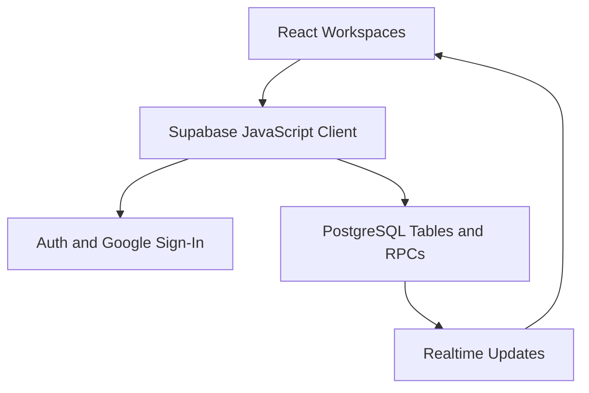

# LifeCity Attendance

**A welcoming check-in experience. A dependable record of every gathering.**

LifeCity Attendance is a QR-based church attendance web application for **LifeCity Church of Christ**. It brings member registration, personal QR codes, service management, camera check-in, attendance reporting, and account administration into one workspace.

Members get a personal space for their profile, QR, attendance history, and feedback tickets. Guests can explore public gatherings without an account. Administrators manage day-to-day registration and check-in, while the Owner handles account access, identity-link reviews, shared appearance, activity history, and submitted feedback.

[Live Web App](https://lifecity-attendance.vercel.app/) · [Source Repository](https://github.com/gbppimentel-dev/lifecity-attendance) · [Backend Contract](docs/backend-contract.md)

> **Project stage:** the web experience has completed its current polish phase. Mobile polishing is next. The repository package version remains `0.1.0`; the in-app changelog describes development milestones rather than claiming a released v1.0.
>
> **New installation note:** this repository contains the current frontend, but only the initial database SQL. The deployed application requires additional tables, functions, policies, and triggers that are not yet tracked here. Running `supabase/schema.sql` alone will **not** provision the full current app. See [Backend Setup](#backend-setup) before attempting a fresh installation.

## Contents

- [What the App Does](#what-the-app-does)
- [Workspaces and Access](#workspaces-and-access)
- [Typical Workflows](#typical-workflows)
- [Architecture](#architecture)
- [Technology Stack](#technology-stack)
- [Local Development](#local-development)
- [Backend Setup](#backend-setup)
- [Data, QR Codes, and Privacy](#data-qr-codes-and-privacy)
- [CSV Imports and Exports](#csv-imports-and-exports)
- [Appearance and Motion](#appearance-and-motion)
- [Project Structure](#project-structure)
- [Deployment](#deployment)
- [Validation and Troubleshooting](#validation-and-troubleshooting)
- [Maintaining the Project](#maintaining-the-project)
- [Current Limits and Next Phase](#current-limits-and-next-phase)
- [Credits and License](#credits-and-license)

## What the App Does

### Member Directory

- Register and edit member profiles with names, contact details, active/inactive status, and private administrative notes.
- Associate members with multiple churches and ministries.
- Search, filter, sort, and paginate the directory.
- Star members and use the supported bulk actions to manage selections.
- View member details and personal QR codes.
- Download QR images and generated member IDs.
- Import CSV data with mapping, validation, preview, and review before submission.
- Export a quick directory or a detailed administrative CSV.

### Services and Gatherings

- Create and edit services with a name, start date/time, venue, Sunday-service flag, public visibility, and administrative note.
- Distinguish upcoming, in-progress, completed, and archived services.
- Archive or restore services through the available action flow.
- Delete services only when the applicable data rules allow it.
- Search, filter, sort, paginate, and export service data.
- Open the scanner directly from a service's camera action.
- Show eligible public services to guests and members.

### QR Check-In and Kiosk

- Select a service and scan member QR codes with the device camera.
- Display successful, duplicate, and unsuccessful check-in feedback.
- Search for a member and check in manually when a QR code cannot be scanned.
- Retry camera startup and switch available cameras.
- Offer torch control when the camera/browser supports it.
- Use a full-screen kiosk layout with a large camera area and a dedicated feedback panel.
- Keep member details out of the QR payload: the app uses an opaque token.
- Refresh relevant attendance totals through subscriptions and other component refresh behavior.

Camera, fullscreen, torch, audio, and device-selection support depend on the browser and hardware. Kiosk presentation is not an operating-system lockdown feature.

### Dashboard and Attendance Records

- View a dashboard snapshot, attendance totals, and recent check-in activity.
- Open historical records with service and member filters.
- Narrow reports by church, ministry, Sunday-service selection, date range, and report scope.
- Default Records to completed services; explicitly choose in-progress or archive-inclusive scopes when needed.
- Exclude upcoming services from reportable attendance history.
- Inspect saved member/service snapshot information and provenance.
- Export matching records across pages using Quick or Detailed CSV.

The service directory export and attendance report export serve different purposes: one describes services as they currently exist; the other reports recorded attendance with saved historical details.

### Personal Member Space

- View the linked directory profile and personal attendance QR.
- Download a QR or member ID and review attendance history.
- Browse upcoming/current gatherings.
- Update a mobile number directly through the supported profile flow.
- Submit other profile changes for Owner review.
- Review previous profile-change requests without stretching the adjacent QR card.
- Follow personal feedback tickets, see unread updates, and mark updates as read.

Signing in does not automatically connect a Google account to a member record. Unlinked users submit a link request so the Owner can verify the connection.

### Owner Workspace

- Search and review accounts, roles, access status, and member links.
- Grant or remove administrator access, suspend/reactivate accounts, and manage profile connections.
- Review member-link and profile-change requests with confirmation steps.
- Inspect activity history and use its export flow.
- Edit shared appearance settings with a custom color picker and live preview.
- Review feedback, reveal a masked sender when needed, and update ticket status.

### Feedback and Release History

- Open a compact feedback launcher from the shared application footer area.
- Submit a bug report, feature idea, improvement, or other app feedback while signed in.
- Choose to hide identity by default in the Owner inbox.
- Track tickets as **New**, **In Progress**, **Completed**, or **Considered**.
- See role-specific What’s New entries and Version History.
- Open the searchable Tech Stack page from the footer.

“Completed” means an improvement has been implemented. “Considered” keeps an idea available for possible future work. Internally, existing backend values `resolved` and `closed` remain mapped to those visible labels for compatibility.

## Workspaces and Access

| Capability | Guest | Signed-In Member / User | Administrator | Owner |
| --- | --- | --- | --- | --- |
| Browse public gatherings | Yes | Yes | Yes | Yes |
| View own linked profile and QR | No | When linked | When linked | When linked |
| Submit app feedback | No | Yes, with active access | Yes, with active access | Yes, with active access |
| Track own feedback tickets | No | Member space | Member space when linked | Member space when linked |
| Manage directory and services | No | No | Yes | Yes |
| Scan and review attendance reports | No | No | Yes | Yes |
| Review member-link/profile requests | No | No | No | Yes |
| Manage accounts and shared appearance | No | No | No | Yes |
| Inspect Owner feedback inbox/activity | No | No | No | Yes |

This table summarizes frontend workspaces. Deployed database policies and RPC authorization must enforce the same boundaries. Hiding a control in React is not an authorization boundary. Account status can also restrict access independently of role.

## Typical Workflows

### Register → Connect → Check In

1. An administrator registers a member or imports reviewed directory data.
2. The member receives a QR code or member ID.
3. The member signs in with Google and, if necessary, submits a link request.
4. The Owner verifies the requested identity and connects the account to the directory profile.
5. An administrator chooses the appropriate service and scans the member QR.
6. The app records attendance or reports an existing check-in.
7. Staff review attendance in Records and export the desired report.

### Correct a Profile

1. A linked member opens **Edit Profile & Requests**.
2. Mobile changes use the direct-save confirmation flow.
3. Other profile fields are submitted as a review request.
4. The Owner compares existing and requested values and approves or declines.
5. The member can read the outcome and any accompanying review note.

### Turn Feedback Into an Update

1. A signed-in user submits feedback about LifeCity Attendance.
2. The Owner reviews it and updates its status.
3. The sender sees unread ticket updates in their member space.
4. Implemented changes are marked Completed; deferred ideas can remain Considered.
5. Maintainers add shipped improvements to `src/lib/releaseNotes.ts`, assigning the correct audiences to each highlight.

## Architecture



The frontend is a TypeScript React single-page application bundled by Vite. `App.tsx` resolves authentication/account state and selects the appropriate workspace. Staff navigation uses component state rather than a routing library. Larger screens are loaded lazily; `ScreenBoundary` supplies loading/error containment.

Supabase provides authentication, database queries, RPC access, and Realtime subscriptions. Components use hooks to load data, debounce searches, coordinate mutations, and refresh results. There is no separate custom Node/Express backend in this repository.

The interface uses custom CSS, theme variables, SVG illustrations, Lucide icons, native browser dialogs, and the Web Animations API. The new Tech Stack view is a lazy-loaded, full-screen dialog: closing it restores the preceding screen instead of discarding its state.

## Technology Stack

### Direct Packages

Versions below are declared ranges from `package.json`; `package-lock.json` is authoritative for exact installed versions.

| Package | Declared Version | Actual Role |
| --- | --- | --- |
| `react` | `^19.1.1` | Components, hooks, state, lazy loading |
| `react-dom` | `^19.1.1` | DOM rendering and portals |
| `@supabase/supabase-js` | `^2.57.4` | Authentication, queries, RPCs, Realtime |
| `html5-qrcode` | `^2.3.8` | Camera QR decoding |
| `qrcode.react` | `^4.2.0` | SVG QR generation |
| `papaparse` | `^5.5.3` | CSV import parsing |
| `lucide-react` | `^0.544.0` | Interface icons |
| `@vitejs/plugin-react` | `^5.0.2` | React integration for Vite; build tooling even though listed under dependencies |
| `typescript` | `~5.9.2` | Strict type checking |
| `vite` | `^7.1.3` | Development server and production bundling |
| `@types/react` | `^19.1.12` | React type definitions |
| `@types/react-dom` | `^19.1.9` | React DOM type definitions |
| `@types/papaparse` | `^5.5.2` | Papa Parse type definitions |

### Platform Technologies and Services

| Area | Technologies and Use |
| --- | --- |
| Markup and styles | HTML, custom CSS, CSS variables, gradients, media queries, keyframes |
| Language output | TypeScript/TSX compiled into JavaScript; ES modules |
| Data | PostgreSQL, SQL functions/RPCs, Row Level Security, UUIDs, initial-schema `pgcrypto` extension |
| Identity | Supabase Auth and Google OAuth |
| Live updates | Supabase Realtime database-change subscriptions |
| Camera and kiosk | Browser media APIs, video tracks/capabilities, Fullscreen API |
| Sound | Web Audio API scanner feedback |
| Images and downloads | SVG, Canvas 2D, Blob, object URLs, file inputs, browser download links |
| Time | JavaScript Date and Intl formatting, including `Asia/Manila` |
| Interaction | Native dialogs, Web Animations API, ResizeObserver, DOM events |
| Preferences and request IDs | Local Storage and Web Crypto UUID generation |
| Web identity | Web App Manifest, favicon, Apple touch icon, standalone-display metadata |
| Development | Node.js, npm, Git, GitHub |
| Hosting | Vercel for the deployed web app; hosting configuration is external to this repository |

The CSS requests Inter first and then system sans-serif fallbacks. This repository does not bundle an Inter font or load Google Fonts; the actual rendered font depends on availability.

The current project does **not** declare React Router, Tailwind, Bootstrap, Radix, Framer Motion, TanStack Query, Workbox, or Capacitor. They should not be added to the inventory merely because another app uses them. Vite's transitive build dependencies remain recorded in the lockfile rather than being presented as separately designed app features.

## Local Development

### Requirements

- Git and npm.
- A Node.js version satisfying the locked Vite engine requirement: `^20.19.0 || >=22.12.0`.
- A compatible Supabase backend with the complete deployed application contract.
- A modern browser. Camera testing requires localhost or an HTTPS origin.

### Install and Run

```bash
git clone https://github.com/gbppimentel-dev/lifecity-attendance.git
cd lifecity-attendance
npm ci
```

Create `.env.local` in the project root:

```dotenv
VITE_SUPABASE_URL=https://YOUR_PROJECT.supabase.co
VITE_SUPABASE_PUBLISHABLE_KEY=YOUR_BROWSER_PUBLISHABLE_KEY
```

These are the **exact names** read by `src/lib/supabase.ts`. An environment variable named `VITE_SUPABASE_ANON_KEY` will not be read by this code unless the code is changed. Use the browser-safe key supplied for the project; never insert a service-role key, database password, or OAuth client secret into a `VITE_` variable.

```bash
npm run dev
```

Open the address printed by Vite, usually `http://localhost:5173`. Restart the development server after changing environment variables.

### Available Commands

| Command | Purpose |
| --- | --- |
| `npm ci` | Install exact dependencies from the lockfile |
| `npm run dev` | Start Vite development server |
| `npm run build` | Run `tsc -b`, then create the production bundle |
| `npm run preview` | Serve the built bundle locally for inspection |

No test or lint command is currently defined in `package.json`. A successful build checks types and bundling; it does not validate a live database, physical camera, browser rendering, or role enforcement.

## Backend Setup

### What Is Tracked

- `supabase/schema.sql`: initial `members`, `events`, and `attendance` tables; UUIDs; indexes; RLS enabled.
- `supabase/add_sunday_service_to_events.sql`: supporting Sunday-service change.

The initial schema enables RLS but does not establish the full current policy set. Its enum/table creation statements are not a migration runner and should not be rerun blindly against an existing database.

### What the Current Frontend Requires

The source contains 41 distinct named RPC calls, including account resolution, directory paging, member imports, service catalogs, dashboard snapshots, historical attendance reports, appearance settings, link/profile reviews, activity history, and feedback.

See **[docs/backend-contract.md](docs/backend-contract.md)** for the complete list with caller paths. Additional tables such as churches (`branches`), ministries, and relationship tables are also used directly by the UI.

Before publishing a reproducible backend installer:

1. Obtain the complete schema/migration history from the deployed Supabase project.
2. Review functions, policies, grants, triggers, indexes, extensions, and bootstrap requirements.
3. Exclude personal member records, authentication secrets, and production credentials.
4. Commit ordered, reviewed migrations and test them on a separate empty project.
5. Document a verified first-Owner bootstrap process. Do not grant access by changing frontend role checks.

This README intentionally does not invent SQL for missing backend contracts or claim that the production database has been audited.

### Authentication Configuration

Enable Google as an authentication provider in the intended Supabase project. Configure its Google OAuth credentials and authorized callback according to that project's Auth settings. Add the local and deployed app URLs to the permitted redirect configuration.

The app requests Google sign-in and returns to its current origin/path. Provider secrets belong in the authentication provider configuration, never in the browser bundle. Hosting, Google, and Supabase dashboard settings are not captured by this Git repository.

## Data, QR Codes, and Privacy

### Core Records

| Record | Purpose |
| --- | --- |
| Member | Directory identity, member number, contacts, status, QR token |
| Service (`events`) | Gathering name, schedule, venue, flags, administrative context |
| Attendance | Member/service relationship, check-in timestamp, status, scanning account |
| Churches / ministries | Organizational categories and member relationships |
| App account | Login identity, role, access status, optional member connection |
| Link/profile request | Reviewed changes and identity-linking workflow |
| Feedback ticket | App feedback, sender visibility preference, status, unread revision tracking |
| Appearance/activity | Shared palette configuration and administrative history |

Not every record in this table has its migration included in the repository.

### QR and Duplicate Handling

QR codes use `att:<opaque token>` rather than names, phone numbers, or email addresses. Treat a personal QR as private: an opaque token avoids embedding personal details, but is still a reusable identifier.

The initial schema enforces one attendance record per member/service through a unique constraint. The scanner handles the corresponding duplicate response and shows “already checked in” feedback. Scanner retry messages do not imply that failed requests definitely created or did not create a record.

### Historical Reporting

Records uses saved snapshots to preserve member and service details as recorded. Some older rows may be labelled **Backfilled from Current Data**, meaning their exact historical values were not available when snapshots were introduced. Current archive status is distinct from saved service details.

Displayed reporting times use Manila formatting where specified. Detailed exports additionally expose ISO/UTC values and provenance fields. Do not infer that every date entry control uses Manila time automatically; inspect the relevant conversion when deploying for another timezone.

### Feedback Identity

“Hide My Identity” masks the sender by default in the Owner inbox. It is **not irreversible anonymity**: the Owner can reveal the name/email through the supported review action. Administrators do not receive the Owner feedback workspace. Actual enforcement depends on deployed database permissions.

### Public Repository Hygiene

Never commit member CSVs, QR tokens, personal IDs, downloaded attendance reports, service-role keys, database credentials, or OAuth secrets. Browser publishable keys are designed for frontend use, but the project still requires correct backend authorization. CSV exports can contain contact information and administrative notes; share them only with intended recipients.

## CSV Imports and Exports

### Imports

Use the app's import interface and its field-mapping/validation preview rather than assuming an arbitrary spreadsheet format is accepted. First and last names and a church selection are validated. The workflow supports full member imports and contact-update handling through separate server calls.

Preserve mobile numbers and member numbers as text when editing spreadsheets. Review duplicate and invalid-row feedback before submitting. Backend validation remains necessary even when the browser preview passes.

### Exports

| Export | Intended Content |
| --- | --- |
| Members · Quick | Member number, names, email, mobile, status, starred state, churches, ministries |
| Members · Detailed | Quick fields plus internal member ID, registration time, category IDs, private admin note |
| Services · Quick/Detailed | Current service details and attendance totals; detailed adds administrative/internal fields |
| Records · Quick | Eight reporting columns, including saved member/service details and check-in/status |
| Records · Detailed | 32 fields including identifiers, saved contacts, times, notes, and snapshot provenance |
| Activity | Owner activity export supported by the deployed activity RPC |

Directory export UI advertises up to 20,000 members; service export UI advertises up to 10,000 services. These flows use current filters, not just the visible page. Records fetches report batches and checks report consistency during export.

The member CSV helper quotes values, escapes quotes, emits a UTF-8 BOM, and neutralizes formula-like prefixes. Inspect each export path independently before assuming identical behavior across every CSV. In Excel, explicitly import mobile-number fields as text to preserve leading zeroes.

## Appearance and Motion

The shared theme contains 37 color controls grouped into brand, backgrounds, surfaces, text, buttons, decoration, and feedback. A custom picker and interactive preview help the Owner inspect the palette before saving. Derived shades and readable color pairs are maintained in `theme.ts` and `themeShades.ts`.

Motion preference is stored locally for the browser/device. Decorative animations respect the app setting and reduced-motion preference where implemented. Forms use immediate state changes in places where animated closing previously caused visual artifacts.

Keep new components tied to existing theme variables and the `data-lc-motion` convention. Do not introduce an unrelated hard-coded palette or animation dependency for a small feature. The Tech Stack page follows these conventions.

## Project Structure

| Path | Responsibility |
| --- | --- |
| `src/App.tsx` | Authentication entry, role workspaces, staff page selection, service management |
| `src/main.tsx` | React root, stylesheet order, motion runtime |
| `src/components/Dashboard.tsx` | Snapshot metrics and recent activity |
| `src/components/MemberManager.tsx` / `MemberImport.tsx` | Directory operations and CSV import |
| `src/components/AttendanceScanner.tsx` / `ScannerServicePicker.tsx` | Camera check-in and service selection |
| `src/components/AttendanceRecords.tsx` / `ServiceExport.tsx` | Historical reporting and service export |
| `src/components/MemberPortal.tsx` / `GuestPreview.tsx` | Member and public experiences |
| `src/components/ProfileChanges.tsx` / `MemberLinkRequests.tsx` | Profile and identity review workflows |
| `src/components/AccountsSettings.tsx` / `SettingsWorkspace.tsx` | Owner account/settings workspace |
| `src/components/FeedbackWidget.tsx` / `FeedbackInbox.tsx` / `MyFeedback.tsx` | Feedback submission, Owner review, sender tracking |
| `src/components/AppFooter.tsx` / `TechStackPage.tsx` | Shared footer and full-screen technology explorer |
| `src/lib/techStack.ts` | Searchable technology inventory |
| `src/lib/releaseNotes.ts` | Audience-tagged release highlights and history |
| `src/lib/supabase.ts` | Browser Supabase client and environment checks |
| `src/lib/theme.ts` / `themeShades.ts` / `appearance.ts` | Theme values, derived shades, shared appearance loading |
| `src/lib/motion.tsx` | Motion preference/runtime and transition helpers |
| `src/lib/memberCsv.ts` | Member CSV formatting |
| `src/*.css` | Core, landing, UI polish, motion, appearance, feedback, tech-page styling |
| `public/` | App icons and web manifest |
| `supabase/` | Tracked initial database SQL |
| `docs/backend-contract.md` | Frontend RPC dependency inventory |

## Deployment

The existing web app is hosted on Vercel. For the Vite project:

| Setting | Value |
| --- | --- |
| Build command | `npm run build` |
| Output directory | `dist` |
| Frontend variables | `VITE_SUPABASE_URL`, `VITE_SUPABASE_PUBLISHABLE_KEY` |

Configure the same variables in the intended deployment environment and allow the deployed origin in Supabase Auth. Changes to build-time variables require a new build/deployment. Preview and production environments should point to the intended backend deliberately.

Connecting a repository to Vercel and enabling automatic deployments are hosting-dashboard settings. A push to `main` only triggers deployment when that integration is configured. This repository does not include a server runtime, native mobile wrapper, or deployment secret store.

The manifest and icons provide a standalone web identity. There is no service worker registration or offline cache in the audited source; online functionality must not be advertised as offline-capable.

## Validation and Troubleshooting

### Suggested Manual Smoke Check

1. Open the welcome screen and guest view without signing in.
2. Test Google sign-in, sign-out, and the unlinked account experience.
3. Check role boundaries with separate user, administrator, and Owner accounts.
4. Browse and filter directory/services; verify an empty result and multiple pages.
5. Scan a valid member QR and repeat it for the same service.
6. Check a manual lookup, camera retry, device switch, and kiosk exit.
7. Review Records scope and export a small sample of every required CSV type.
8. Submit a link/profile request and review its outcome with the appropriate role.
9. Submit feedback, update its status, and verify the sender's unread indicator.
10. Change appearance and motion settings; inspect text, hover, focus, and reduced-motion states.
11. Open Tech Stack from each workspace footer, search/filter it, and close it with Back and Escape.
12. Confirm that What’s New does not show staff-only features to guests.

Use test data and a separate backend when a check would change live member or attendance records.

| Symptom | Check |
| --- | --- |
| Missing Supabase settings | Exact `.env.local` variable names; restart Vite |
| Missing function / `PGRST202` | Current backend RPC migrations; see backend inventory |
| Empty or rejected data operations | Account state, linkage, RLS policies, function grants |
| Google returns to the wrong site | App origin and Auth redirect configuration |
| Camera unavailable | HTTPS/localhost, site permissions, camera availability, another app using the camera |
| Torch or switch unavailable | Actual device capabilities and available video inputs |
| Duplicate attendance | Whether the member is already checked in to that service |
| Unexpected historical details | Snapshot provenance; distinguish backfilled data from captured-at-check-in data |
| Motion absent | Device preference, reduced-motion setting, intentionally immediate form behavior |
| Mobile loses leading zeroes in CSV | Spreadsheet import column type |
| Deployment ignores a push | Git integration, production branch, build logs, environment configuration |

## Maintaining the Project

For every shipped batch:

1. Update `src/lib/releaseNotes.ts` with concrete completed changes.
2. Assign each highlight to `guest`, `user`, `admin`, and/or `owner` as appropriate. Shared highlights can target all four.
3. Update `src/lib/techStack.ts` and this README when a technology is added, removed, or changes purpose.
4. Refresh `docs/backend-contract.md` when RPC dependencies change.
5. Preserve the lockfile and verify `npm run build`.
6. Test the affected role/workflow and motion/theme variants.
7. Keep migrations in version control once the complete backend history is recovered.

A documentation change should distinguish installed packages, actually used APIs, external services, and future plans. Do not label a platform supported solely because an icon or manifest entry exists.

## Current Limits and Next Phase

- Full backend migration history is not included in `main` yet.
- No automated test suite or lint command is configured in the package scripts.
- The web app relies on network access; offline attendance synchronization is not implemented.
- Browser support for camera controls, sound, and fullscreen varies.
- The repository does not contain Capacitor, Android, or iOS project configuration.
- Mobile UI polish is planned after this web wrap-up; native packaging should be documented only when implemented.
- Public source availability does not itself establish a software license.

## Credits and License

Built for **LifeCity Church of Christ** and maintained in the public repository by **gbppimentel-dev**. Thanks to the maintainers of the open-source packages and platform tools listed above. Their names and marks belong to their respective owners.

No project license file was present in the audited repository. Confirm reuse and redistribution terms with the maintainer before treating the application as permissively licensed. Dependency licenses remain the responsibility of their respective packages.

> “So whether you eat or drink or whatever you do, do it all for the glory of God.” — 1 Corinthians 10:31
